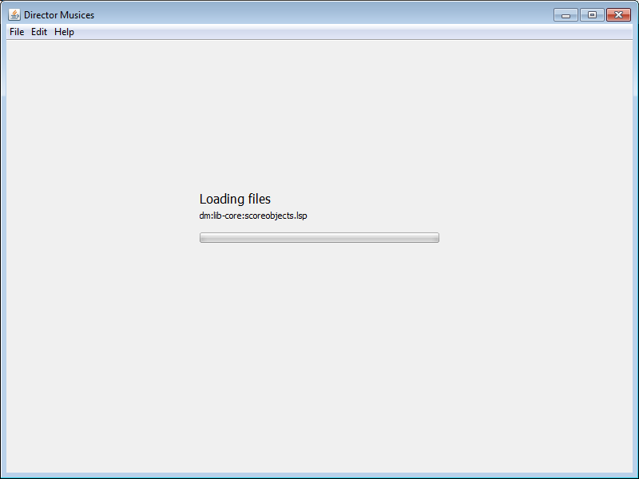
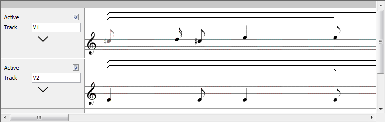
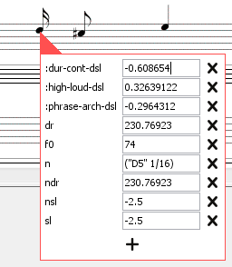
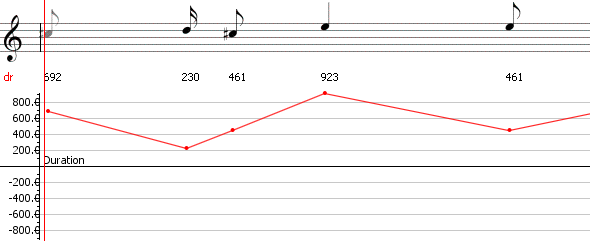
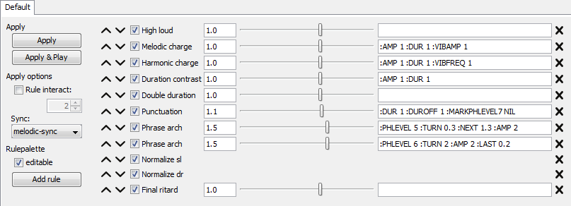

# Using director musices

Note: *DM* is short for Director Musices.

## Starting

The first step is to start the program itself.
This is done by double clicking on the .jar file that you have downloaded.
If this does not work, you need to start a terminal/command prompt and 
`cd` into the directory of the program.
In there, type `java -jar director-musices-x.x.x-standalone.jar`.
Replace the x's with the correct version. Note that it's usually enough to
type the first part of the filename, e.g. `direct`, then press `tab` - the
terminal will then fill out the rest of the name for you.

If all went well, you should be greeted with a splash screen. After that
you should see something like this:

## Loading

Whenever something is loading, a small "bouncing ball" as well
as a short info message will be shown in the top right corner.

## Score

### Opening

There are several ways to open a score;

* By pressing *Open test score*.
* By pressing *Open from disk...*.
* From the menu, either: 
  *Open score...*, *Open performance...* or *Import score from midi file...*.

*Open from disk...* and *Open score...* does exactly the same thing.

A score is a *.mus* file, a special format created for *DM*. Specifies
a musical score.

A performance is a *.perf* file. The format is essentially the same as
a score, but contains extra information.
Read more about the difference between a score and a performance in the
[performance section](#performance).

### Saving

Essentially the same as opening.

### Score view

If you press *Open test score*, you get:

**Track options** can be found to the left.
Clicking the down arrow expands the options.
Important to know about these:

* If *Active* is deselected, that track will be completely disabled.
* Pan goes from 0 (left) to 127 (right), where 64 is the center.

The other settings should be mostly self-explanatory.

**The position indicator** is shown in red. This shows where
the player is currently positioned within the score.

**The position setter** is shown in gray at the top. Clicking anywhere
in this area sets the player position to that position.

**The phrase marks** is shown above each musical score.

### Note editing

Note editing is done either by double clicking a note, or right clicking and
selecting *Edit note...* in the menu.

### Graph and parameter views

A graph view displays a value of a parameter in the score. It can be displayed
by right clicking the score and selecting *Show Graph...*.

Graphs can either be automatically scaled or not.
This can be enabled or disabled by right clicking on the graph. The automatic scaling
always shows all the values. While disabled, some values can be cut off. This is
useful because sometimes a very small number of values can be very large compared
to the rest. With automatic scaling, the large numbers completely take over,
flattening out the smaller values and making them indistinguishable from other
small values.

Parameter view has the same purpose as the graph view, but is more basic.
It can be displayed by right clicking the score and selecting *Show Parameter...*.

If you don't know what a parameter is called, it can be useful to right click
a note in the score and selecting *Edit Note...*, the name of parameters there
is the same as used by the parameter view. Some useful parameters are:

* **dr** - the duration of notes.
* **sl** - the soundlevel of notes.
* **phrase-start** - start of phrases.
* **phrase-end** - end of phrases.

Both views can be removed by right clicking on them and selecting the appropriate
item.

In this image, the display of numbers with *dr* to the left is a parameter view.
The lower graphical display is the same parameter but in a graph view.

## Rulepalette

## Player

## Performance
